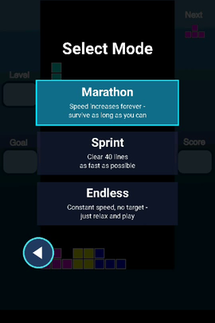

# Droids

Droids is a Tetris clone for Android. The game includes a playing field consisting of a 12 × 10 grid and 7 geometric figures called "tetrominoes". The aim of the game is to fit these tetrominoes between them in order to complete lines that will be deleted. Each level has a goal (Goal) of lines to complete. Exceeded this goal, the level increases and with it the speed of tetrominoes. The ultimate goal is to be able to gain the highest score possible before the game ends. The game ends when a tetramino reaches the top edge of the playing field. The player wins points every time you complete a line or accelerates the fall of a tetromino.

This game has been created only for educational purpose, it has no claim to be a complete game distributable through the Android market. It's my belief that you can get inspiration from this source code to implement your own video games.

# Features

- **Three game modes** — Marathon (speed ramps up forever, survive as long as you can), Sprint (clear 40 lines as fast as possible, with a timer), and Endless (constant speed, no target, relaxed play).
- **Touch controls** — drag to move, tap to rotate (with wall kicks), swipe down to soft-drop, swipe up to hold.
- **Hold piece** and a **next-piece queue** (2 pieces ahead).
- **Ghost piece** preview showing where the falling piece will land.
- **Settings screen** — independent Music/SFX toggles, each with its own volume slider.
- **Local high scores** (top 5) and visual level progression (the background shifts every few levels).
- **Animated presentation** — a splash screen with the "DROIDS" block logo, and animated screen transitions (slides between menus, a block wipe into the game).

# Screenshots

 

# Video Demo
[](https://youtube.com/shorts/GojNJ5KhKzE "Video Demo")

# Limitations

- **No crash visibility** — no crash reporting is wired up yet (planned via Play Console's built-in Android vitals once the app is in a testing track).
- **Not on Google Play yet** — no release signing or app bundle; install the debug APK attached to each [GitHub release](https://github.com/sasadangelo/Droids/releases).

See [Phase 4 of the roadmap](docs/ROADMAP.md) for details.

# Roadmap

See [docs/ROADMAP.md](docs/ROADMAP.md) for what's planned next: visual polish, gameplay features to make it a fuller Tetris, and — eventually — a Google Play Store release.

# Credits

The game framework (`org.code4projects.framework`) was written by Salvatore D'Angelo, taking inspiration from the framework presented by [Mario Zechner](https://github.com/badlogic) (@github.com/badlogic) in the book Beginning Android Games, and from the open source library libGDX. No code from those sources was copied; the architecture and class layout follow the same concepts as a learning reference.

The in-game HUD uses the [Lilita One](https://fonts.google.com/specimen/Lilita+One) font by Juan Montoreano, licensed under the [SIL Open Font License 1.1](app/src/main/assets/fonts/LilitaOne-OFL.txt).

# License

The whole project is released under the [MIT license](LICENSE).

# Related Projects

[Alien Invaders](https://github.com/sasadangelo/AlienInvaders), [Mr Snake](https://github.com/sasadangelo/MrSnake)

# Installation & Run

Enable USB Debugging mode that on many devices from 3.2 up to 4.0 (excluded) is in Settings>Applications>Development. On devices from Android 4.0 and later, you’ll find them in Settings>Developer Options. On Android 4.2 and later the option is hidden by default. To make it reappear, go to Setting->Info on the device and tap Version Build 7 times, the option will become visible.

Enable installation from Unknown Sources clicking on Settings->Security.

Download the latest `droids-<version>-debug.apk` from the [latest release](https://github.com/sasadangelo/Droids/releases/latest) and install it.

# Installation & Run from source code

The project is built from the command line with Gradle and does not require Android Studio — any editor (e.g. VS Code) is enough.

## Prerequisites

The project is built with the Gradle Wrapper, so Gradle does not need to be installed separately. The following tools are required:

- **Git**, to download the source code.
- **JDK 17**, required by the Android Gradle Plugin.
- **Android SDK Command-line Tools**.
- **Android SDK Platform-Tools**, which provides `adb` for installing the app on a physical device.
- **Android SDK Platform 37.0**, required by `compileSdk 37` in `app/build.gradle`.
- **Android SDK Build-Tools 37.0.0**, required by `buildToolsVersion` in `app/build.gradle`.

An Android emulator is optional. To use one, also install the **Android Emulator** package and a system image. A physical Android device only needs Platform-Tools and USB debugging enabled.

### macOS setup with Homebrew

Install [Homebrew](https://brew.sh) first if it is not already installed. Then install the JDK and Android command-line tools:

```bash
brew install --cask temurin@17
brew install --cask android-commandlinetools
```

Add Java and the Android SDK tools to Zsh (`~/.zshrc`):

```bash
echo 'export JAVA_HOME=$(/usr/libexec/java_home -v 17)' >> ~/.zshrc
echo 'export ANDROID_HOME="$(brew --prefix)/share/android-commandlinetools"' >> ~/.zshrc
echo 'export PATH="$JAVA_HOME/bin:$ANDROID_HOME/cmdline-tools/latest/bin:$ANDROID_HOME/platform-tools:$PATH"' >> ~/.zshrc
source ~/.zshrc
```

Check that the tools are available:

```bash
java -version
sdkmanager --version
adb version
```

Accept the Android SDK licenses:

```bash
sdkmanager --licenses
```

Install the packages required to build and deploy to a physical device:

```bash
sdkmanager "platform-tools" "platforms;android-37.0" "build-tools;37.0.0" "emulator"
```

If you want to use an emulator, install a system image as well. On Apple Silicon Macs use `arm64-v8a`; on Intel Macs use `x86_64`:

```bash
# Apple Silicon
sdkmanager "system-images;android-37;google_apis;arm64-v8a"

# Intel
sdkmanager "system-images;android-37;google_apis;x86_64"
```

## Get the source and configure the SDK path

```bash
git clone https://github.com/sasadangelo/Droids.git
cd Droids
echo "sdk.dir=$(brew --prefix)/share/android-commandlinetools" > local.properties
```

## Build and run

Use the provided `droids.sh` helper script:

```bash
./droids.sh            # uses a connected physical device if there is one, otherwise the emulator
./droids.sh device      # forces a connected physical device (enable USB debugging on it first)
./droids.sh emulator    # forces the emulator, starting it if it isn't already running
```

The script compiles the debug APK with `./gradlew assembleDebug`, then installs and launches Droids automatically.

If you want to use an emulator and do not have an AVD yet, create one first. Use `arm64-v8a` on Apple Silicon or `x86_64` on Intel:

```bash
# Apple Silicon
avdmanager create avd -n Droids_API_37 -k "system-images;android-37;google_apis;arm64-v8a" -d pixel_3

# Intel
avdmanager create avd -n Droids_API_37 -k "system-images;android-37;google_apis;x86_64" -d pixel_3
```

To run on a physical device instead, enable Developer Options (Settings > About phone > tap "Build number" 7 times), turn on USB Debugging in Settings > Developer Options, connect the phone with a USB **data** cable, select **File Transfer** if necessary, and accept the "Allow USB debugging" prompt. Verify the connection with:

```bash
adb devices
```

The device must appear with the status `device`, not `unauthorized`.

# Troubleshooting

- `./gradlew: Permission denied` — run `chmod +x gradlew` once.
- `adb devices` shows nothing for a physical device — the most common cause is a charge-only USB cable; try a cable known to transfer data, and check the phone's USB connection mode is set to "File Transfer" rather than "Charging only".
- Gradle/Android Gradle Plugin version mismatches — the project uses the Gradle wrapper (`./gradlew`), which downloads the exact Gradle version declared in `gradle/wrapper/gradle-wrapper.properties` automatically, so no manual Gradle installation is needed.
